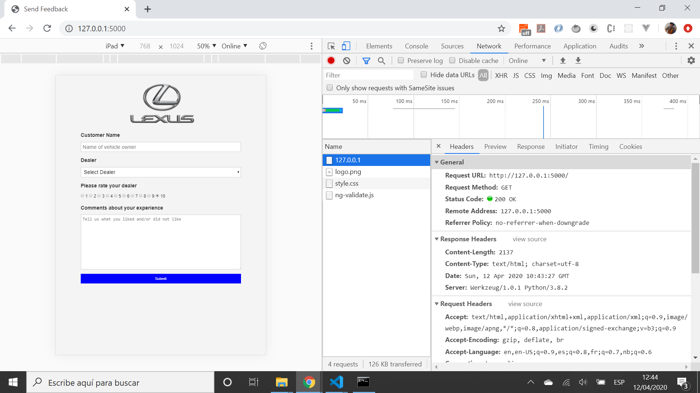
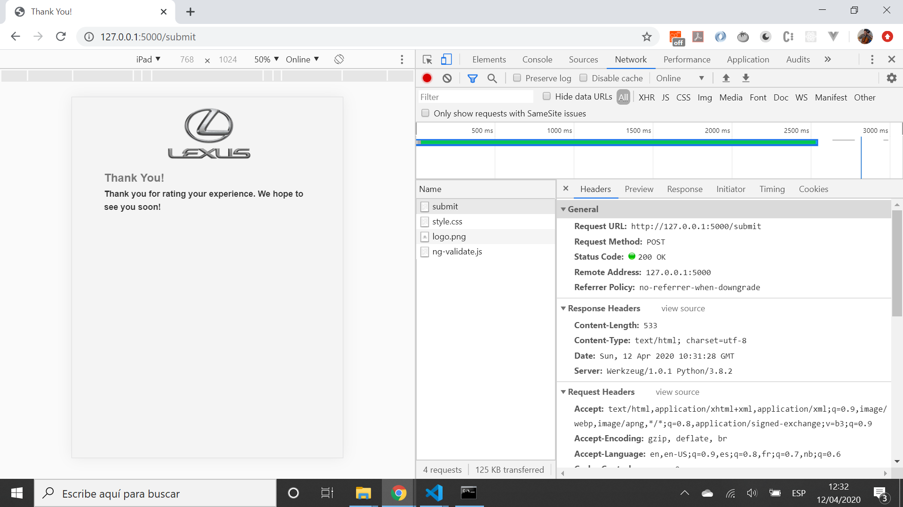

# Python-Flask PostgreSQL Heroku

App to display a feedback form using Python Flask, store the entered data in a PostgreSQL database then send an example email using mailtrap.io. Deployed to Heroku. Tutorial code from [Traversy Media, Youtube video: Build & Deploy A Python Web App | Flask, Postgres & Heroku](https://www.youtube.com/watch?v=w25ea_I89iM)

## Table of contents

* [General info](#general-info)
* [Screenshots](#screenshots)
* [Technologies](#technologies)
* [Setup](#setup)
* [Features](#features)
* [Status](#status)
* [Inspiration](#inspiration)
* [Contact](#contact)

## General info

* Choosing between Flask and Django Python frameworks - Flask is more lightweight and better for small apps such as this one
* PostgreSQL pgAdmin used to create database

## Screenshots





## Technologies

* [Python v3.8.2](https://www.python.org/) programming language
* [Flask v1.1.2](https://palletsprojects.com/p/flask/) micro-framework
* [psycopg2 v2.8.5](https://pypi.org/project/psycopg2/) PostgreSQL database adapter for the Python programming language
* [flask-sqlalchemy v2.x](https://flask-sqlalchemy.palletsprojects.com/en/2.x/) extension for Flask that adds support for SQLAlchemy
* [gunicorn v20.0.4](https://gunicorn.org/) Python WSGI HTTP Server for UNIX
* [PostgreSQL](https://www.postgresql.org/) relational database
* [mailtrap](https://mailtrap.io/) safe Email Testing for Staging & Development
* [Heroku](https://www.heroku.com/what) cloud platform used to deploy app

## Setup

* Create PostgreSQL database and add access credential `SQLALCHEMY_DATABASE_URI` to your own config.py file (not in repo)
* Create mailtrap.io account and add access credentials `MAIL_LOGIN` and `MAIL_PASSWORD` to your own config.py file (not in repo)
* Run `pipenv shell` then `pipenv install` to install dependencies
* Run `python app.py` to open app in server `localhost: 5000`

## Code Examples

* code to submit completed form tto Postgres database

```python
@app.route('/submit', methods=['POST'])
def submit():
  if request.method == 'POST':
    customer = request.form['customer']
    dealer = request.form['dealer']
    rating = request.form['rating']
    comments = request.form['comments']
    if customer == '' or dealer == '':
      return render_template('index.html', message='Please enter required fields')
    if db.session.query(Feedback).filter(Feedback.customer == customer).count() == 0:
      data = Feedback(customer, dealer, rating, comments)
      db.session.add(data)
      db.session.commit()
      send_mail(customer, dealer, rating, comments)
      return render_template('success.html')
    return render_template('index.html', message='You have already submitted feedback')
```

## Features

* SQLAlchemy Object Relational Mapper presents a method of associating user-defined Python classes with the PostgreSQL database table used, and instances of those classes (objects) with rows in this table.
* Access credentials hidden from GitHub in `config.py` file
* [Heroku Python runtime](https://devcenter.heroku.com/articles/python-runtimes)

## Status & To-do list

* Status: Fully working in dev. Deployed to Heroku

* To-do: Use to create more advanced Python-PostgreSQL app

## Inspiration

* [Traversy Media, Youtube video: Build & Deploy A Python Web App | Flask, Postgres & Heroku](https://www.youtube.com/watch?v=w25ea_I89iM)
* [How to Install python 3.8 on Windows 10](https://www.youtube.com/watch?v=bnhQBUEpWlg)

## Contact

Repo created by [ABateman](https://www.andrewbateman.org) - feel free to contact me!
